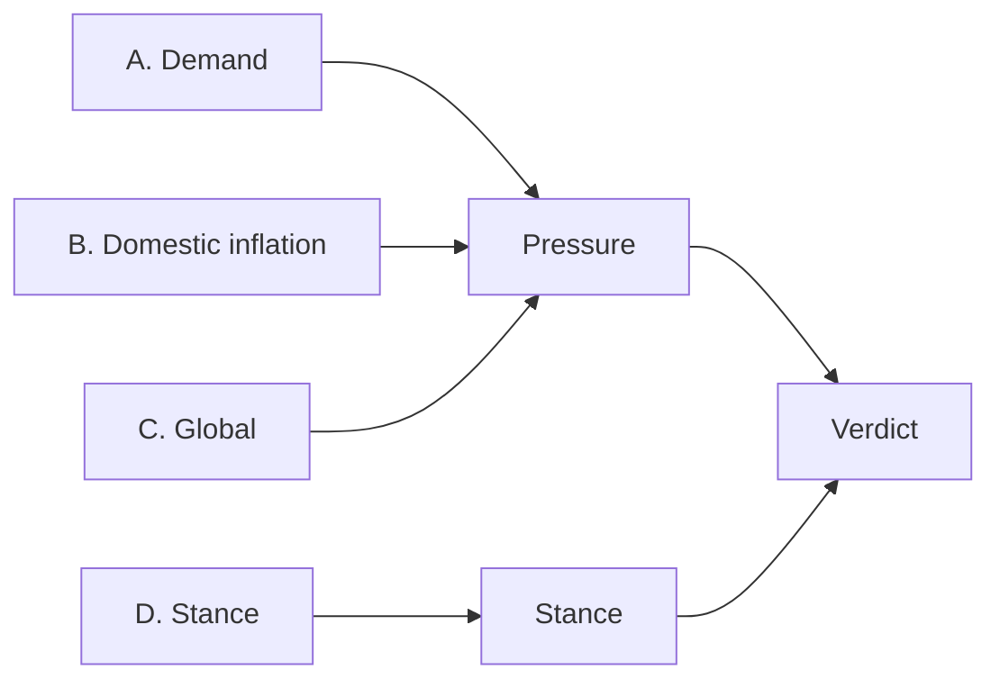
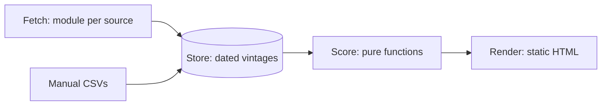

# UK Monetary Policy Dashboard — Build Spec

Sep 24, 2026 · @Patrick

## 1. Purpose and scope

Build a single-screen UK monetary policy dashboard. In 5 seconds a user can state the verdict: is policy tight enough for the inflation pressure? In 30 seconds they can name the driving block and what changed since the last MPC meeting.

| Use case | What the screen must answer |
| --- | --- |
| Release or MPC day | What moved since the last MPC meeting, and did it change the verdict? |
| Onboarding | Where each release fits, and which way each group of indicators points |

**Users.** An economics professor and new team members. They know the New Keynesian model.

**In scope.** UK activity, labour, prices, expectations, global and market data at daily, monthly or quarterly frequency. A transparent scoring layer. A change view against any past date.

**Out of scope.** Forecasting, intraday data, news feeds, user accounts, and paid data licences in version 1.

**Delivery.** Code and data live in a public GitHub repository. GitHub Actions rebuilds the page on a schedule and publishes it to GitHub Pages. The owner's website embeds it with an iframe (Sections 5 and 7).

**Parsimony rule.** Fourteen scored indicators is the cap; adding one means removing one. An element that cannot change the verdict or a block score is context, or it is cut.

## 2. Analytical framework

The dashboard uses a small open-economy New Keynesian model. Three blocks measure inflation pressure; one measures the policy stance. The verdict compares the two.

```latex
\begin{aligned}
\text{IS:}\quad & \tilde y_t = E_t\tilde y_{t+1} - \sigma\,(i_t - E_t\pi_{t+1} - r^*_t) + \alpha\, y^f_t \\
\text{PC:}\quad & \pi_t = \beta E_t\pi_{t+1} + \kappa\,\tilde y_t + \gamma\,\Delta q_t + u_t \\
\text{UIP:}\quad & E_t\Delta e_{t+1} = i_t - i^f_t - \rho_t \\
\text{Rule:}\quad & i_t = r^* + \pi^* + \phi_\pi(\pi_t - \pi^*) + \phi_y\,\tilde y_t
\end{aligned}
```

e and q are the sterling price of foreign currency, so a rise is a depreciation; the sterling ERI moves the other way. Foreign rates reach UK inflation through sterling (UIP), so the dashboard scores sterling, not the rate spread.

| Block | Question | Model terms | Output |
| --- | --- | --- | --- |
| A. Demand | Is the economy running hot or cold? | ỹ | Score, z |
| B. Domestic inflation | Is underlying inflation consistent with 2%? | π, Eπ | Score, z |
| C. Global | Is the world pushing UK inflation up or down? | y^f, Δq, u | Score, z |
| D. Stance | Is policy tight or loose, looking two years ahead? | i − Eπ − r\* | Real-rate gap, pp |



The verdict compares the two dials' classes (Section 3):

| Pressure \\ Stance | Loose | Neutral | Tight |
| --- | --- | --- | --- |
| Up | Hawkish risk | Hawkish risk | On track |
| Neutral | Hawkish risk | On track | Room to ease |
| Down | On track | Room to ease | Room to ease |

The verdict says which way the data argue policy should move. It does not say what markets price; the policy path chart shows that.

**Release map.** Use this to place any headline before interpreting it.

| Release or event | Block | Indicators moved |
| --- | --- | --- |
| ONS CPI | B; context | Services CPI; headline CPI |
| ONS labour market | A and B | Unemployment, vacancies per unemployed, payrolls; private regular pay |
| ONS monthly GDP | A | GDP growth |
| Decision Maker Panel (monthly) | B | Firms' expected price growth |
| BoE/Ipsos Inflation Attitudes Survey (quarterly) | B | Household expectations |
| Agents' summary (quarterly, confirm) | A | Capacity utilisation |
| Oil, gas or sterling moves | C | Brent, gas, ERI |
| Fed or ECB decision | C, D | ERI; 2y OIS via spillover |
| MPC decision, minutes, MPR | D | 2y OIS, Bank Rate; MPR projection, r\* inputs |
| Budget or fiscal event | Not scored | Logged in release drawer; affects A with a lag |

## 3. Scoring method

Any number on the screen must be reproducible by hand from its tooltip. Every parameter below lives in config, not code.

| Step | Rule |
| --- | --- |
| 1. Benchmark b | A target-consistent level with a cited source where one exists; otherwise the series mean over its full pre-2020 sample. |
| 2. Scale σ | Standard deviation over the full pre-2020 sample. Needs at least 10 years; otherwise a config scale with a stated rationale. |
| 3. z-score | z = s·(x − b)/σ, clipped at ±3. s = +1 or −1, so positive always means inflationary. |
| 4. Direction | z > +0.5 up; z < −0.5 down; otherwise neutral. |
| 5. Block score | Equal-weighted mean of the block's z. Diffusion = count up / neutral / down. |
| 6. Pressure | 0.5·B + 0.3·A + 0.2·C (config). Up if > +0.5; Down if < −0.5; else Neutral. |
| 7. Stance | Real rate r = 2y OIS − expected inflation (Section 4). Gap = r − r\* midpoint, in pp. Tight if r > r\* high; Loose if r < r\* low; else Neutral. |
| 8. Verdict | Classes as −1, 0, +1 (Tight = +1). Verdict = class(Pressure) − class(Stance): ≥ +1 Hawkish risk; 0 On track; ≤ −1 Room to ease. |
| 9. Driver | The block with the largest weight × score, shown next to the verdict. |
| 10. Change | Every number shows its change since the Compare-to date (default: last MPC). |

Stance is in pp, not z: a z-score of the real rate over a sample half spent at the zero lower bound is meaningless. The r\* range is the neutral zone, so r\* uncertainty is shown, not hidden. The band's minimum half-width is 0.5pp (config).

**Data rules.**

- Freshness: config holds each indicator's frequency and usual publication lag. An indicator is stale if its next release is more than 14 days overdue.
- Ragged edge: carry the latest value forward; never interpolate. Quarterly series are carried to monthly.
- Smoothing, if any, is declared per indicator and shown in the tooltip.
- Tooltips show x, b, σ, s, z, date and source.
- The README reports the share of clipped observations per indicator.

## 4. Indicators

Fourteen scored indicators. Benchmarks marked *config* are defaults for the team to review. The agent resolves series codes, records them in config and checks each against the publisher's page.

### A. Demand

| Indicator | Transform | Benchmark | Sign | Source |
| --- | --- | --- | --- | --- |
| Unemployment rate | 3m avg, % | u\*, latest MPR estimate (manual) | − | ONS LFS |
| Vacancies per unemployed | ratio | pre-2020 mean | + | ONS |
| PAYE payrolled employees | 3m/3m annualised %, flash month dropped | pre-2020 mean; config σ | + | ONS / HMRC RTI |
| Real GDP | 3m/3m annualised % | potential growth, 1.0% (config; confirm vs MPR) | + | ONS |
| Capacity utilisation | Agents' score | 0 | + | BoE Agents' scores (confirm file) |

LFS response rates are poor; payrolls are the cross-check. GDP growth measures the change in the output gap, not its level.

### B. Domestic inflation

| Indicator | Transform | Benchmark | Sign | Source |
| --- | --- | --- | --- | --- |
| Services CPI | y/y % | 3.25% target-consistent (config) | + | ONS |
| Private-sector regular pay | 3m avg y/y % | 2% + trend productivity, 3.25% (config) | + | ONS AWE |
| Firms' expected own-price growth | year ahead, % | pre-2020 mean (confirm start); config σ | + | Decision Maker Panel |
| Household inflation expectations | 1y ahead, median % | pre-2020 mean | + | BoE/Ipsos Inflation Attitudes Survey |

The services CPI tooltip flags indexed and regulated items and April effects.

### C. Global (one needle)

| Indicator | Transform | Benchmark | Sign | Source |
| --- | --- | --- | --- | --- |
| Brent crude, $ | 12m % change | 0 | + | FRED |
| UK wholesale gas | 12m % change | 0 | + | ONS System Average Price (confirm series) |
| Sterling ERI | 12m % change | 0 | − | BoE |
| Trading-partner leading indicator | euro area and US; weights in config (confirm vs export shares) | 100 | + | OECD CLI |

Sterling enters once, through the ERI. Oil is in dollars so the exchange rate is not counted twice. UK gas is priced in sterling, a small overlap the team accepts.

### D. Stance

| Indicator | Definition | Class rule | Source |
| --- | --- | --- | --- |
| Real-rate gap | 2y OIS − MPR year-ahead CPI projection − r\* mid, pp | Tight / Neutral / Loose vs r\* range | BoE yield curves (confirm 2y OIS point); MPR (manual); r\* table |

Stance uses the 2y OIS rate, not Bank Rate, so a hawkish hold or a guidance shift registers on the day. It is deflated by the MPR projection, which is not scored in Pressure, so no data surprise moves both dials.

**Neutral-rate table.** Hand-maintained rows of r\* estimates: source, low, high, date. Sources are MPR or staff estimates and MPC speeches. The team sets the range used in config; the agent does not choose it. There is no market-based r\* proxy, because forward rates include term premia.

### Context (not scored)

| Item | Where shown |
| --- | --- |
| Headline CPI y/y vs 2% and vs MPR projection | Verdict strip |
| Latest MPC vote split; next MPC date | Verdict strip |
| Bank Rate; OIS path now and at Compare-to; neutral band | Policy path chart |
| Illustrative rule: r\* mid + 2 + 1.5·(core CPI − 2) + 0.5·(−2·(u − u\*)) | Policy path chart, dotted |
| 2y and 10y gilts; quoted 2y fixed mortgage rate | Card D drill-down |
| 5y5y implied inflation forward (now CPIH basis post-2030 RPI reform; not comparable with pre-reform history) | Card B drill-down |

The rule is a Taylor-type benchmark, labelled illustrative. The MPC does not follow it.

## 5. Layout and interaction

One screen, read top to bottom in the order of the inference: verdict, dials, blocks, evidence. Rows 1–3 fit 1440×900 without scrolling.

| Row | Content |
| --- | --- |
| 1. Verdict strip | Verdict word (largest text) and “driven by \[block\]”. Pressure bullet bar on −3..+3 with ±0.5 bands. Stance bar in pp with the r\* band shaded. A tick at the Compare-to value on both bars. Headline CPI vs 2%. MPC vote, data as-of date, next MPC date. |
| 2. Block cards | Title = the block's question. Score (1dp) and bar. Signed change since Compare-to. Diffusion dots. 24-month score sparkline. Card D: gap in pp on the r\* band, labelled Loose ←→ Tight. |
| 3. Policy path chart | Bank Rate for the past 2 years. OIS path now, and at Compare-to in thin grey. Nominal neutral band (r\* range + 2%). Rule, dotted. MPC dates as ticks. |
| 4. Evidence table | One row per indicator, grouped by block, collapsed by default. Columns: value and unit, date, benchmark, z, change since Compare-to, 24-month level sparkline with benchmark line. |

**Interactions (the complete list).**

| Control | Behaviour |
| --- | --- |
| Hover | Value, date, x, b, σ, s, z, source, notes |
| Click a block card | Expands that block's rows in the evidence table |
| Compare-to selector | Presets: last MPC (default), last release, 3 months ago; or any date |
| Release log drawer | Latest release per indicator, newest first: value, previous, MPR projection where one exists, consensus if entered by hand, change in z. Fiscal events listed. |

No other controls, filters or tabs.

**Embed view.** The same page opened with `?view=embed` shows rows 1–2 only, plus a “Full dashboard” link that opens in a new tab.

- It must read well from 640px to 1200px wide, since a website's content column is narrower than a full screen.
- It has no page header or footer of its own, and a transparent background. Theme follows the viewer's system setting unless the host page sets `&theme=light` or `&theme=dark`.
- It posts its height to the parent page on load and resize, so the iframe fits without scrollbars.

## 6. Visual design rules

Two tests: a new team member states the verdict and driver in 5 seconds, and what changed in 30 seconds. Every rule below serves those tests.

**Hierarchy.** Verdict > dials > cards > chart > table, set by size and position, not colour or boxes. One prominent number per card.

**Colour.** Colour means one thing: inflationary or not. It is never applied to Stance, where “up” means tight.

| Element | Colour encoding |
| --- | --- |
| Indicators, blocks A–C, Pressure | Orange = inflationary (z > 0.5); blue = disinflationary; grey = neutral |
| Stance | Greyscale marker on a grey r\* band |
| Verdict word | Orange = Hawkish risk; blue = Room to ease; grey = On track |

- Colour-blind-safe blue/orange. No red or green: higher inflation is not “bad data” in this frame.
- Everything else is greyscale.
- Colour is never the only cue; a sign, arrow or word always repeats it.

**Scales and charts.**

- Pressure and blocks A–C on a fixed −3..+3 scale. Stance on a fixed −4..+4 pp scale, clipped with a marker.
- Bullet bars, not gauges. Zero or benchmark line always shown.
- Direct labels, minimal gridlines, no 3D, shadows or animation.

**Type and numbers.** One sans-serif family, three sizes, tabular figures. z, % and pp to 1dp; units always shown. Jargon appears only in tooltips, beside its plain name.

**States and accessibility.** Stale values greyed with their date. WCAG AA contrast. Light and dark themes. Keyboard navigation. Below 900px, rows stack in reading order.

## 7. Data pipeline and architecture

A Python build script fetches, scores and renders one static HTML page. GitHub Actions runs it and GitHub Pages hosts it, so there is no server to maintain.



| Component | Specification |
| --- | --- |
| indicators.yaml | id, name, block, source, code, attribution, freq, lag, transform, benchmark, σ override, sign, smoothing, note |
| weights.yaml | Pressure weights, class thresholds, r\* range, band minimum, rule coefficients |
| manual/ CSVs | r\* table; MPR CPI projection, u\*, potential growth; MPC dates and votes; fiscal events; optional consensus |
| Fetchers | BoE Database CSV; BoE yield curve files; ONS API; FRED (free key); OECD SDMX; DMP, Inflation Attitudes Survey and Agents' spreadsheets; gas source (confirm) |
| Store | Parquet files committed to a data branch; each run saved as a dated vintage |
| Compare-to | Uses the stored vintage for the date. Before the first vintage, uses current data labelled “revised”. |
| Score | Pure functions, unit-tested on fixtures, with a golden test for all nine verdict cells |
| Render | One self-contained HTML file; Observable Plot bundled inline; no network calls when viewed |
| Refresh | 07:10 UK daily (after 07:00 ONS releases); 12:15 UK on MPC days; manual trigger; one-command local run. Details below. |
| Failure | Keep the last good value, mark it stale, log it, still build |

- Confirm the publication lag of the BoE OIS curve. If it lags, show its date on card D.

### Hosting on GitHub

This is feasible and free for a public repository.

| Component | Specification |
| --- | --- |
| Repository | Public. Code on `main`; data vintages on a `data` branch, so code history stays readable. |
| Workflow | `build.yml`: set up Python, fetch, score, render, commit the vintage to `data`, deploy `site/` to Pages. Triggers: schedule, manual run from the Actions tab, and push to `main`. |
| Schedule | Cron runs in UTC. Schedule both 06:10 and 07:10 UTC; the script exits unless it is 07:10 UK time. Use the same pattern for 12:15 UK, running only on dates in `manual/mpc_dates.csv`. |
| Secrets | FRED API key as a repository secret. No other credentials. |
| Address | `https://<user>.github.io/<repo>/` by default. A custom subdomain on the owner's domain is optional, via a CNAME record. |
| Embed snippet | The README gives the iframe tag (`?view=embed`, `loading="lazy"`, a descriptive `title`, width 100%, no border) and a short host-page script that sets the iframe height from the posted message. |
| Public footer | Data as-of time, sources with attribution, a methodology page generated from config, and “Not investment advice.” |
| Alerts | Email on failed runs is left on (GitHub's default for the workflow's owner). |

**Constraints the build must handle.**

- Scheduled runs can start late when GitHub is busy. On release days, the owner uses the manual trigger.
- GitHub disables schedules in public repositories after 60 days without activity. The daily data commit should count as activity (confirm); the README says how to re-enable.
- Pages from a private repository needs a paid GitHub plan. The default is public, which suits a hand-reproducible method.
- The owner has approved republishing every series in this spec for academic, non-commercial use, with attribution. Config holds each source's attribution line, and the footer and tooltips show it. Use each publisher's requested wording where it gives one (e.g. ONS under the Open Government Licence, OECD under CC BY 4.0).

## 8. Build phases, acceptance and open questions

Build in four phases, and show a working page at the end of each.

| Phase | Delivers |
| --- | --- |
| 1 | Repository, Actions workflow and Pages deploy; config, fetchers, store and scoring for blocks A and B, with tests; a plain page listing the scores, live on Pages |
| 2 | Blocks C and D, r\* table, verdict grid, policy path chart |
| 3 | Layout and design pass (Sections 5–6), Compare-to, release log, embed view |
| 4 | Evidence table, methodology page; README with the release map, backcast, clip shares and embed snippet |

**Acceptance tests**

| Test | Pass condition |
| --- | --- |
| Reproducibility | Any block score recomputed by hand from its tooltips |
| Verdict logic | Golden test passes for all nine grid cells |
| Backcast | Monthly verdicts from 2015, on current data and the current r\* range, charted in the README and reviewed by the team against MPC decisions |
| Saturation | Clip share reported per indicator; any above 25% since 2021 carries a note |
| Usability | Two people new to the page state the verdict and driver within 5 seconds |
| Config | Changing a benchmark, weight or r\* range changes the page with no code edits |
| Layout | Rows 1–3 fit 1440×900; the page stacks in reading order below 900px |
| Robustness | Refresh under 2 minutes; one failed source still yields a page |
| Access | Colour-blindness simulation and WCAG AA pass |
| Embed | On a test host page at 640px and 1200px, the iframe shows rows 1–2 with no scrollbars, and the full-dashboard link works |
| Scheduled build | Seven consecutive daily runs deploy; a forced source failure still deploys; every series on the public page shows its source attribution |

**Open questions for the team**

| Question | Note |
| --- | --- |
| Pressure weights | 0.5 / 0.3 / 0.2 for B / A / C is a default, not an estimate; equal weights are the alternative |
| Services and pay benchmarks | 3.25% assumes about 1.25% productivity growth; the post-2008 trend suggests lower (confirm) |
| r\* range | Which sources, and how wide |
| Stance deflator | MPR year-ahead projection or its two-year average; DMP firms' CPI expectation as a fallback |
| Leading-indicator weights | Euro area vs US shares |
| Gas source | Which series |
| Web address | Default github.io address, or a subdomain of the owner's website |
